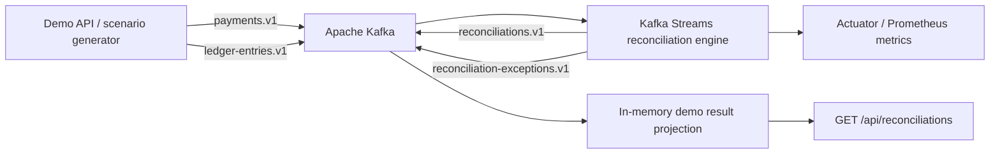

# LedgerGuard

[](https://github.com/stevearmstrong-dev/ledgerguard/actions/workflows/ci.yml)
[](https://adoptium.net/)
[](https://kafka.apache.org/)

LedgerGuard is a real-time financial transaction reconciliation system built with Java, Spring Boot, and Kafka Streams. It correlates independently produced payment and ledger events, identifies inconsistencies, and emits an auditable outcome stream.

The project uses synthetic data and rules. It contains no employer code, proprietary calculations, or internal system details.

## What it demonstrates

- Event-time stream processing and out-of-order event handling
- Stateful Kafka Streams joins
- Exactly-once processing
- Bounded, persistent event-ID deduplication
- Explicit exception routing
- Idempotent Kafka production
- Metrics with Spring Boot Actuator, Micrometer, and Prometheus
- Topology, domain, simulator, and real-broker tests

## Architecture



The system is intentionally split into three focused modules:

| Module | Responsibility |
| --- | --- |
| `ledgerguard-contracts` | Immutable payment, ledger, and reconciliation event contracts |
| `ledgerguard-reconciliation` | Deduplication, event-time joins, classification, routing, and metrics |
| `ledgerguard-demo-api` | Scenario generation and a queryable projection of recent outcomes |

## Reconciliation outcomes

| Status | Meaning |
| --- | --- |
| `MATCHED` | Amount and currency agree |
| `AMOUNT_MISMATCH` | Currencies agree but amounts differ |
| `CURRENCY_MISMATCH` | Payment and ledger currencies differ |
| `MISSING_LEDGER_ENTRY` | A payment has no ledger counterpart when the join window closes |
| `MISSING_PAYMENT` | A ledger entry has no payment counterpart when the join window closes |
| `DUPLICATE_PAYMENT` | A payment event ID was already observed |
| `DUPLICATE_LEDGER_ENTRY` | A ledger event ID was already observed |

## Run locally

Requirements:

- Java 21
- Docker Desktop or another Docker-compatible runtime

Build and start Kafka:

```bash
./mvnw clean verify
docker compose up -d --wait
```

Start the reconciliation engine:

```bash
java -jar ledgerguard-reconciliation/target/ledgerguard-reconciliation-0.1.0-SNAPSHOT.jar
```

In another terminal, start the demo API:

```bash
java -jar ledgerguard-demo-api/target/ledgerguard-demo-api-0.1.0-SNAPSHOT.jar
```

Run a scenario and inspect the result:

```bash
curl -X POST http://localhost:8080/api/scenarios/amount-mismatch
curl http://localhost:8080/api/reconciliations
```

Available scenarios:

```text
matched
amount-mismatch
currency-mismatch
missing-ledger-entry
missing-payment
duplicate-payment
out-of-order-match
```

The engine exposes health and metrics on port `8081`:

```bash
curl http://localhost:8081/actuator/health
curl http://localhost:8081/actuator/metrics/ledgerguard.reconciliations
curl http://localhost:8081/actuator/prometheus
```

## Correctness choices

LedgerGuard uses event timestamps rather than wall-clock processing time. Payments and ledger entries are joined within a 10-second window with a 3-second grace period. This lets records reconcile even when they arrive in the opposite order.

Duplicate IDs are retained in persistent window stores for 24 hours. This bounds state growth while covering a realistic upstream retry horizon. Both decisions are documented in [`docs/adr`](docs/adr).

## Test strategy

- Domain tests exercise every reconciliation classification.
- `TopologyTestDriver` tests the real Kafka Streams topology without mocks.
- Simulator tests verify the exact event patterns produced by demo scenarios.
- A Spring context test verifies production constructor wiring.
- A Testcontainers smoke test validates compatibility with the official Apache Kafka image when Docker is available.

Run all checks with:

```bash
./mvnw verify
```

## Roadmap

- PostgreSQL-backed query projection and audit history
- Live operations dashboard
- OpenTelemetry traces across publishing and reconciliation
- Schema evolution and compatibility checks
- Controlled replay from historical offsets

## License

MIT License. Copyright 2026 Steve Armstrong.
